# StockOrbit

個人用的 Firstrade 投資組合追蹤網站：自動同步持股（含現金）、依配置給出建議、對任意再平衡策略跑歷史回測，加上一整套風險/稅務/複利分析工具，全部透過一個零建置流程的網頁儀表板操作。

## 畫面

以下截圖全部用假資料（虛構的持股/交易紀錄，不是真實帳戶），深色模式，照儀表板側邊選單的分組列。

### 持股管理

#### 總覽

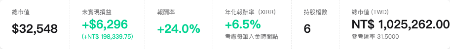

一進頁面就看到總市值、未實現損益、報酬率、年化報酬率（XIRR，考慮每筆入金時間點）、持股檔數，右邊多一張換算成台幣的總市值卡片（用 Yahoo Finance 的參考匯率，不是特定銀行的買賣價）。

#### 接下來預測

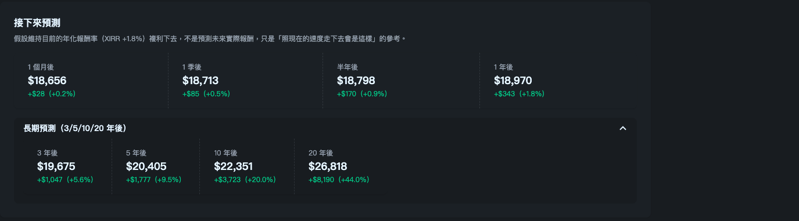

假設維持目前的年化報酬率（XIRR）複利下去，1 個月／1 季／半年／1 年後大概會是什麼樣子，純粹是「照現在的速度走下去」的參考，不是報酬預測。3／5／10／20 年這種長期推算放在預設收合的區塊裡（極端 XIRR 複利很多年後的數字會很誇張，收合避免一進站就嚇到人）。

#### 目標達成進度追蹤

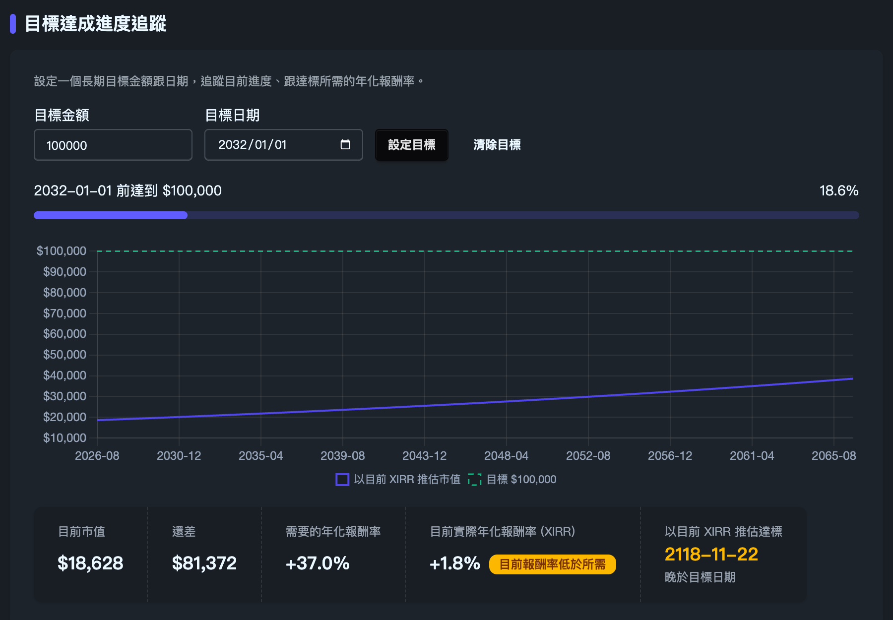

設定一個長期目標金額跟日期，進度條顯示目前市值 vs 目標，算出達標所需的年化報酬率，跟目前實際 XIRR 對照，超前/落後會有徽章標示。

#### 持股與配置

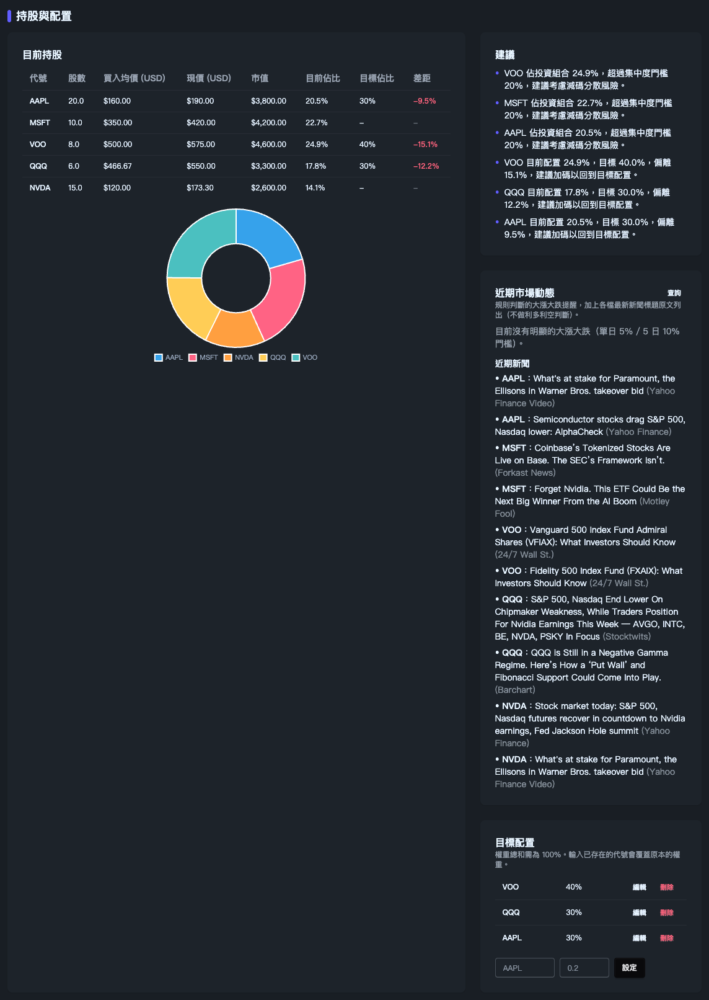

- 持股表格：代號、股數、買入均價、現價（漲跌用綠/紅標示）、漲跌幅、市值，加上「目前佔比」跟「目標佔比」並排，偏離超過 5% 會標紅加粗；跟下面的「目標配置」是同一份資料、改了會一起動。配置圓餅圖在表格下方，hover 會顯示每檔的市值
- 「建議」：依集中度跟配置偏離規則列出的提醒，不是投資建議
- 「近期市場動態」：按查詢會抓每檔持股最近的大漲大跌（規則判斷）跟最新新聞標題（原文列出，不做利多利空判斷）
- 「目標配置」：每列同時顯示目前跟目標佔比，方便對照；可以新增/編輯/刪除每檔的目標權重，權重總和要是 100%，輸入代號時有自動完成建議

#### 再平衡建議金額

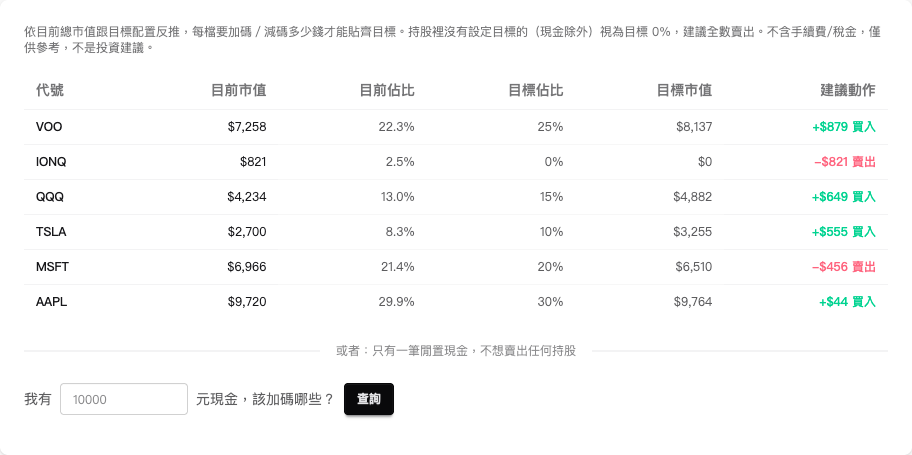

依目前總市值跟目標配置反推每檔要加碼/減碼多少錢才能貼齊目標；也支援「只有一筆閒置現金」情境，算出怎麼分配最接近目標，同時顯示加碼前後的配置比例對照。

#### 已實現損益

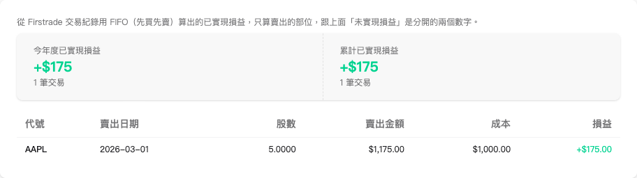

從交易紀錄用 FIFO（先進先出）配對買賣，列出每筆已實現損益明細，加上今年度跟累計的彙總數字。跟未實現損益是分開的兩個數字。

#### 海外所得試算

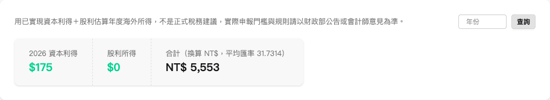

已實現利得＋股利換算成台幣，粗估是否達到海外所得申報／課稅門檻。僅供參考，不是正式稅務建議，實際規則請以財政部公告或會計師意見為準。

#### 稅務效率分析

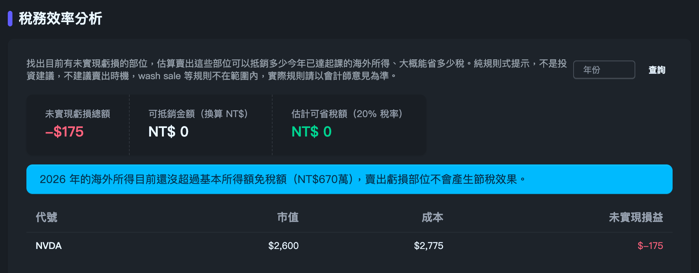

找出目前有未實現虧損的部位，估算賣出這些部位可以抵銷多少今年已達起課的海外所得、大概能省多少稅。估計金額會正確地被「今年海外所得是否已超過免稅額」這個前提卡住，超過才會顯示實際數字，不會憑空誇大節稅效果。純規則式提示，不建議賣出時機，wash sale 等規則不在範圍內。

#### 股利追蹤

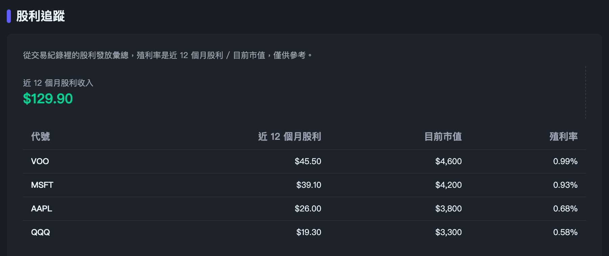

從交易紀錄裡的股利發放彙總，近 12 個月股利收入跟每檔的殖利率（近 12 個月股利 / 目前市值）。

#### 配息月曆

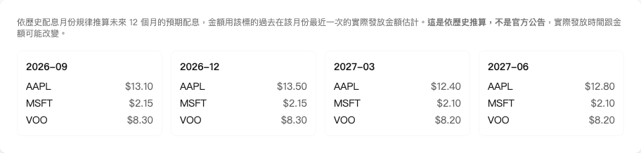

依歷史股利發放的月份規律，推算未來 12 個月哪些月份、哪些標的預期會配息，金額用該標的過去在該月份最近一次的實際發放金額估計。明確標示這是依歷史推算，不是官方公告。

#### 持股筆記

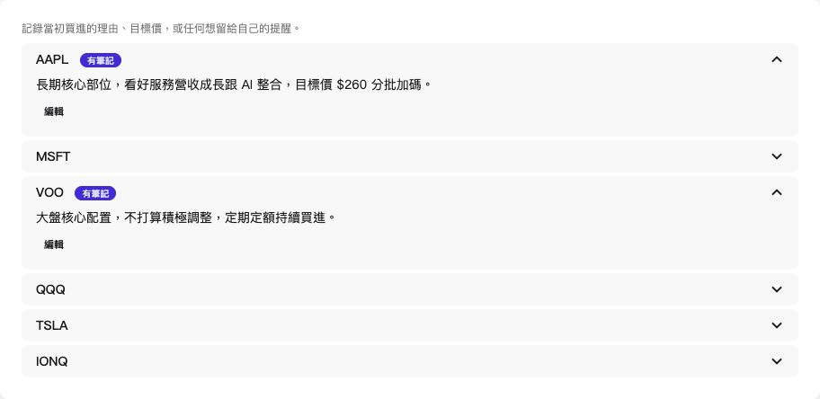

記錄當初買進的理由、目標價，或任何想留給自己的提醒。已經寫過筆記的標的預設顯示唯讀文字，點「編輯」才會變成可編輯的表單，不會讓人誤以為是還沒儲存的草稿。每次儲存會另外留一筆帶時間戳記的歷史版本，「歷史版本」摺疊列表由新到舊列出，方便回顧當初的想法怎麼變的。

### 市場資訊

#### 持股健康度總覽

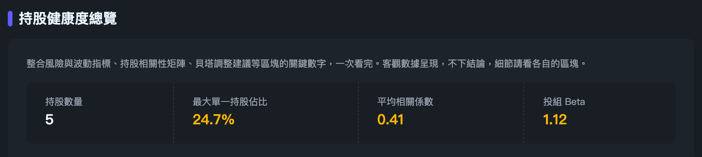

把風險與波動指標、持股相關性矩陣、貝塔調整建議等區塊的關鍵數字整合成一張卡片：持股數量、最大單一持股佔比、平均相關係數、投組 Beta，一次看完。客觀數據呈現，不下結論，細節請看各自的區塊。

#### 風險與波動指標

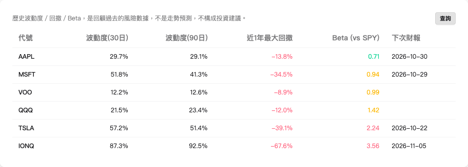

每檔持股的 30/90 日年化波動度、近 1 年最大回撤、Beta（vs SPY）、下次財報日提醒（近期有財報會標黃色徽章）。是回顧過去的風險數據，不是走勢預測。

#### 價格/技術指標

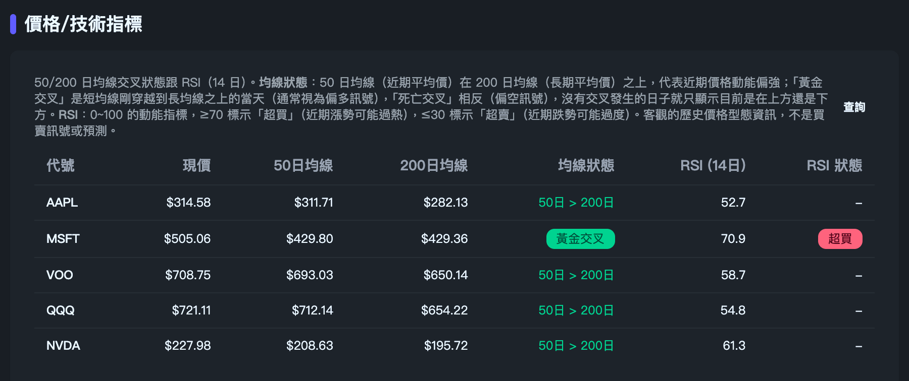

50/200 日均線交叉狀態（黃金交叉/死亡交叉，或穩定的高於/低於）跟 RSI（14 日，標示超買/超賣）。客觀的歷史價格型態資訊，不是買賣訊號或預測。

#### 持股基本面分析

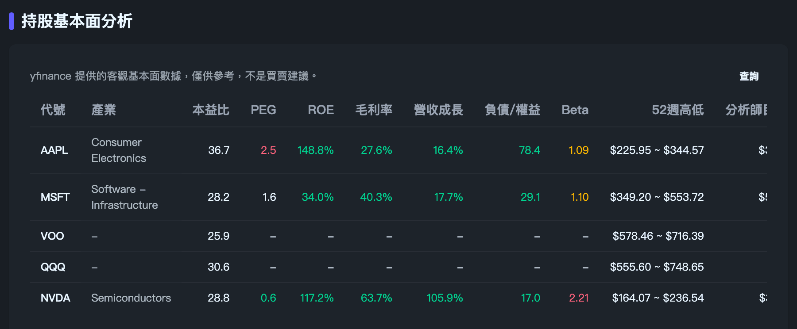

本益比、PEG、ROE、毛利率、營收成長、負債權益比、52 週高低、分析師目標價與評等等 yfinance 客觀數據。Render 連不到 Yahoo 即時 API 時會自動退回排程更新的快取（見下方技術棧）。

### 歷史分析

#### 配置歷史走勢

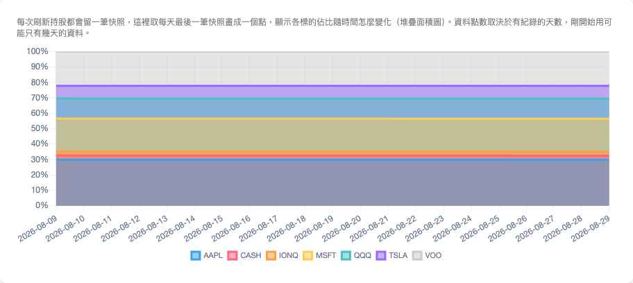

每次刷新持股都會留一筆快照，這裡取每天最後一筆快照畫成一個點，顯示各標的佔比隨時間怎麼變化。

#### 持股集中度歷史走勢

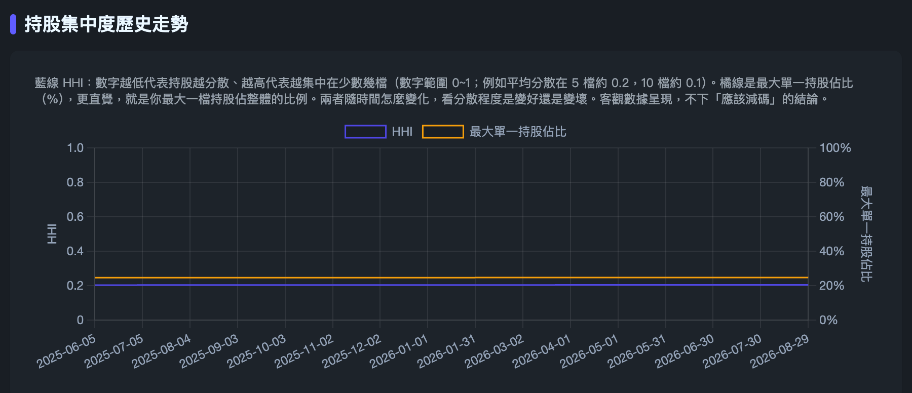

HHI（賀氏指數，數字越低代表持股越分散）跟最大單一持股佔比，隨時間怎麼變化，看分散程度是變好還是變壞。客觀數據呈現，不下「應該減碼」的結論。

#### 持股歷史走勢

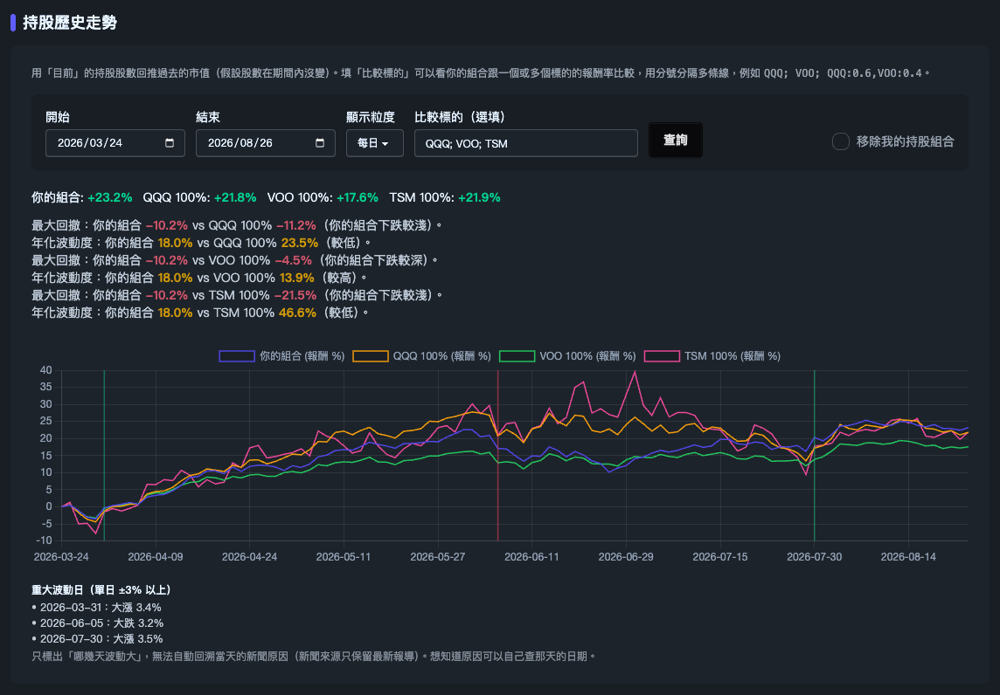

用「目前」的股數回推過去市值，可選每日／每月／每季／每年顯示。填「比較標的」可以看你的組合跟一個或多個標的的報酬率比較，用分號分隔多條線，例如 `QQQ; VOO; QQQ:0.6,VOO:0.4`。支援任意 Yahoo Finance 代號，包括台股（例如 `0050.TW`、`00631L.TW`）。每條比較線都會算出自己的最大回撤跟年化波動度，跟你的組合逐一列出比較文字。圖上的直線標出單日 ±3% 以上的「重大波動日」，滑鼠移過去會顯示當天漲跌幅。

右上角「移除我的持股組合」勾選後，比較線不再受限於你持股裡最晚上市那一檔的起始日期（例如比特幣現貨 ETF 通常 2024 年才上市），可以看比較標的完整的歷史。

#### 再平衡策略回測

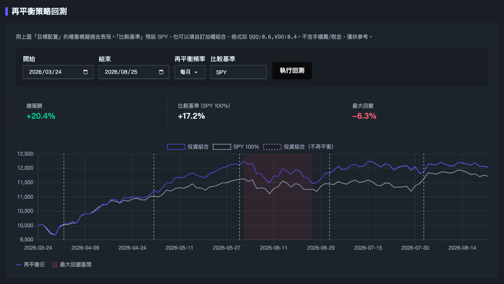

用「目標配置」的權重模擬過去表現，可選再平衡頻率（不再平衡／每月／每季／每半年／每年）。「比較基準」預設 SPY，同樣支援分號分隔的多條線跟任意加權組合（也支援台股）。圖上虛線標出每次再平衡發生的日期，陰影區塊是最大回撤發生的區間，選了再平衡頻率時還會多畫一條「不再平衡」的對照虛線，直接看再平衡本身帶來的差異。不含手續費/稅金，僅供參考，不是真實交易模擬。

#### 複利曲線估算

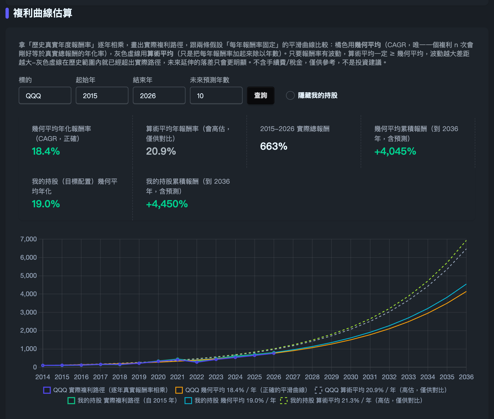

拿「歷史真實年度報酬率」逐年相乘，畫出實際複利路徑，跟兩條假設「每年報酬率固定」的平滑曲線比較：橘色用**幾何平均**（CAGR，唯一一個複利 n 次會剛好等於真實總報酬的年化率），灰色虛線用**算術平均**（只是把每年報酬率加起來除以年數，只要報酬率有波動就一定 ≥ 幾何平均，波動越大差距越大）。可以疊加你的持股（目標配置）曲線一起比較，也能隱藏。

#### 個股複利體質檢查清單

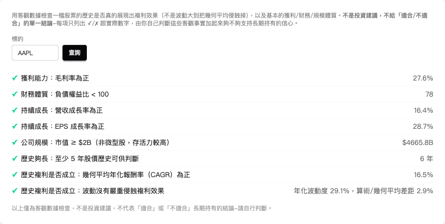

用客觀數據檢查一檔股票的歷史是否真的展現出複利效果（不是波動大到把幾何平均侵蝕掉），以及基本的獲利/財務/規模體質。每項只列出 ✓/✗ 跟實際數字，**不給總分、不給「適合/不適合」的單一結論**，由你自己判斷這些客觀事實加起來夠不夠支持長期持有的信心。

#### 持股相關性矩陣

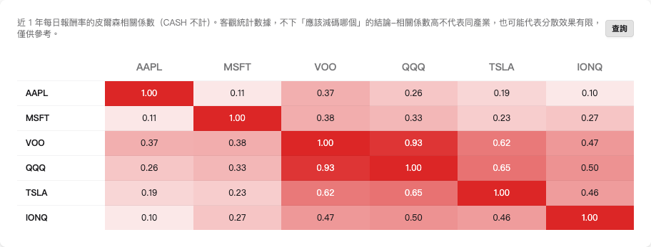

近 1 年每日報酬率的皮爾森相關係數，用顏色矩陣呈現真實的統計連動程度（不只是名目產業分類，不同產業的標的也可能高度連動）。相關係數高不代表同產業，也可能代表分散效果有限。

#### 貝塔調整建議

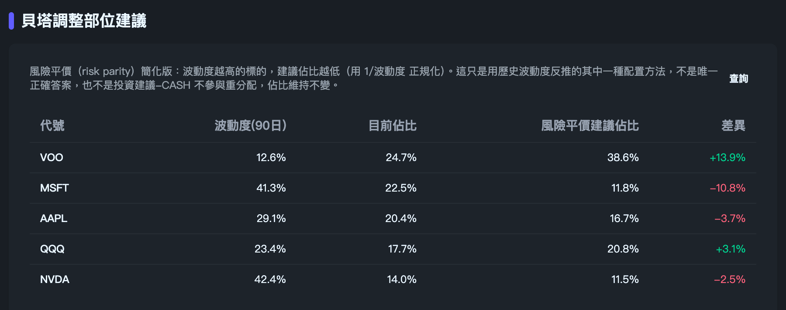

風險平價（risk parity）簡化版：波動度越高的標的，建議佔比越低（用 1/波動度 正規化）。這只是用歷史波動度反推的其中一種配置方法，不是唯一正確答案，也不是投資建議。

#### 情境模擬

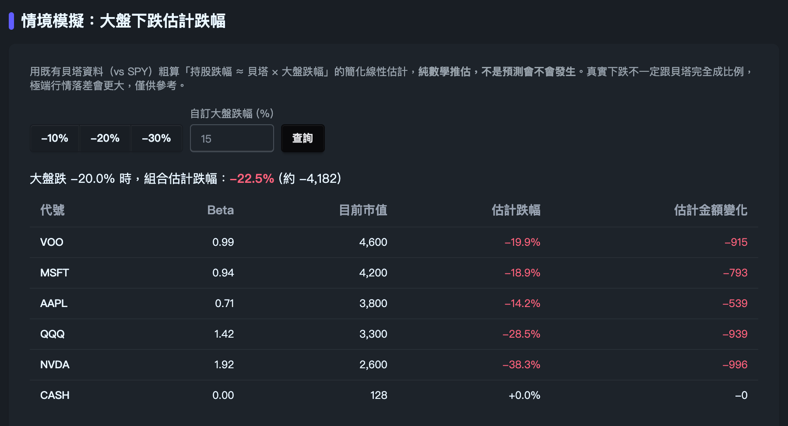

用既有貝塔資料（vs SPY）粗算「持股跌幅 ≈ 貝塔 × 大盤跌幅」的簡化線性估計，**純數學推估，不是預測會不會發生**。真實下跌不一定跟貝塔完全成比例，極端行情落差會更大。

#### 定期定額比較

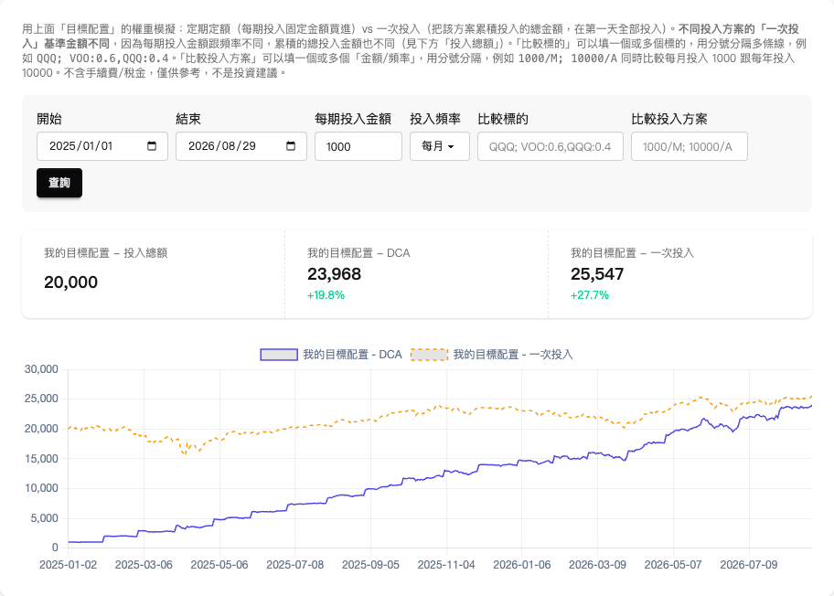

模擬定期定額（每期投入固定金額買進）vs 一次投入（把該方案累積投入的總金額，在第一天全部投入）。「比較標的」可以填一個或多個標的，「比較投入方案」可以填一個或多個「金額/頻率」（例如 `1000/M; 10000/A` 同時比較每月投入 1000 跟每年投入 10000），全部同時畫在同一張圖上比較。不同投入方案的「一次投入」基準金額不同，因為累積的總投入金額本來就不一樣。

#### 股利再投入試算

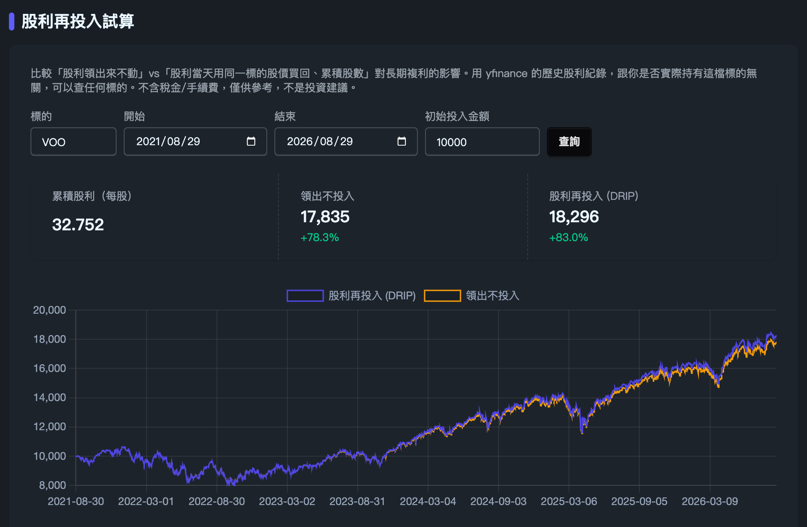

比較「股利領出來不動」vs「股利當天用同一標的股價買回、累積股數」對長期複利的影響。用 yfinance 的歷史股利紀錄，跟是否實際持有這檔標的無關，可以查任何標的。

#### 定投高點回本風險

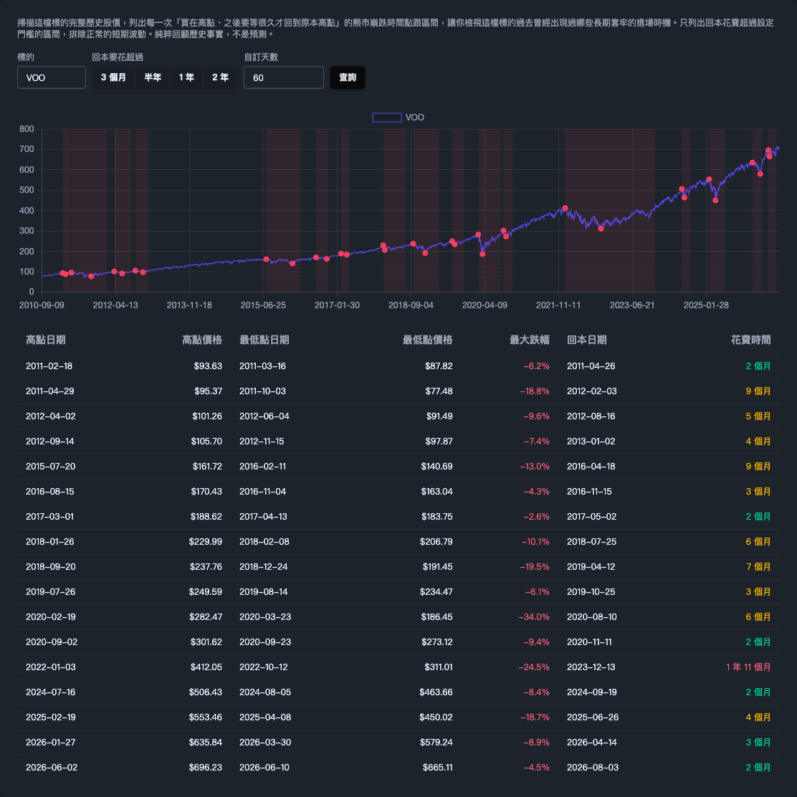

掃描任一標的完整歷史股價，找出每一次「買在高點、之後要等很久才回到原本高點」的熊市崩跌時間點跟區間，歷史上曾經出現過哪些長期套牢的進場時機，一次看完。回本門檻可以用 3個月／半年／1年／2年 快選按鈕，也可以自訂天數。圖表上每個符合門檻的區間會用淺紅底標出、高低點各標一個點，滑鼠移過去看細節；表格的「花費時間」依嚴重程度上色（輕微綠、中等黃、嚴重紅、超嚴重紅底粗體）。純粹回顧歷史事實，不是預測。

#### 月度/年度績效報告

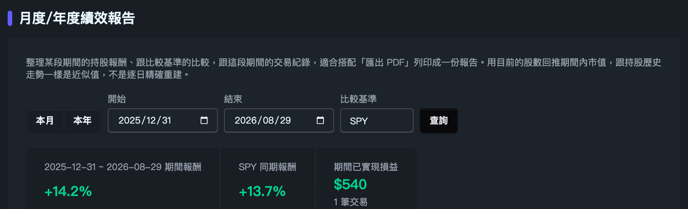

整理某段期間的持股報酬、跟比較基準的比較，跟這段期間的完整交易紀錄，適合搭配「匯出 PDF」列印成一份報告。用目前的股數回推期間內市值，跟持股歷史走勢一樣是近似值。

### 帳號與設定

#### 設定頁

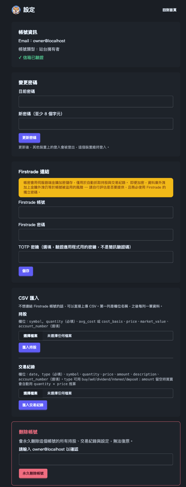

多使用者化後的個人設定頁（`/settings`）：帳號資訊與信箱驗證狀態、變更密碼（會登出其他裝置）、連結自己的 Firstrade 帳號（帳密以 `FT_CREDENTIAL_KEY` 加密存放，只寫不讀）、不想交帳密的話改用 CSV 匯入持股／交易紀錄、以及輸入自己的 email 確認後硬刪除全部資料。

## 功能

上面每張截圖都對應側邊選單的一個區塊；完整功能清單：

### 持股管理

- **持股同步**：透過非官方 Firstrade API 自動登入（支援 TOTP 兩步驟驗證），抓取目前帳戶持倉（含未投入的現金）並存成歷史快照
- **配置建議**：依目前持股計算集中度風險，並比對自訂的目標配置，列出偏離提醒（現金不計入集中度風險）
- **接下來預測**：以目前 XIRR 年化報酬率複利推算 1 個月／1 季／半年／1 年（另外收合區塊裡有 3／5／10／20 年）後的預估市值，純粹是「照現在速度走下去」的參考；長期欄位累積變動過於誇張（超過 +1000%）時加上 ⚠️ 標示，提醒短窗口 XIRR 複利拉遠本來就容易失真
- **目標達成進度追蹤**：設定長期目標金額與日期，追蹤目前進度、達標所需的年化報酬率，跟目前實際 XIRR 對照
- **再平衡建議金額**：依目前總市值跟目標配置反推每檔要加碼/減碼多少錢才能貼齊目標；也支援「只有一筆閒置現金」情境，算出怎麼分配最接近目標
- **已實現損益**：FIFO（先進先出）配對買賣紀錄，列出每筆已實現損益明細跟年度彙總
- **海外所得試算**：已實現利得＋股利換算台幣，粗估是否達到海外所得申報／課稅門檻（僅供參考，非正式稅務建議）
- **稅務效率分析**：找出目前未實現虧損的部位，估算賣出可以抵銷多少今年已達起課的海外所得、大概能省多少稅（純規則式提示，不建議賣出時機）
- **股利追蹤**：近 12 個月各標的股利收入彙總與殖利率
- **配息月曆**：依歷史股利發放的月份規律，推算未來 12 個月的預期配息時間與金額
- **持股筆記**：每檔標的可以記錄當初買進理由、目標價等提醒文字，唯讀/編輯兩種顯示模式；每次存檔會另外留一筆帶時間戳記的歷史版本，筆記下方「歷史版本」摺疊列表由新到舊列出

### 市場資訊

- **持股健康度總覽**：整合風險/相關性/Beta 等區塊的關鍵數字成一張卡片
- **風險與波動指標**：每檔持股的 30/90 日年化波動度、近 1 年最大回撤、Beta（vs SPY）、下次財報日提醒
- **價格/技術指標**：50/200 日均線交叉狀態、RSI（14 日）超買超賣標示，客觀價格型態資訊，不是買賣訊號
- **持股基本面分析**：本益比、PEG、ROE、毛利率、營收成長、負債權益比、52 週高低、分析師目標價與評等等 yfinance 客觀數據；Render 連不到 Yahoo 即時 API 時會自動退回排程更新的快取（見下方技術棧）
- **目前熱門標的**：全市場漲幅/跌幅/成交量排行，附最新新聞標題與關鍵字式利多/利空標示

### 歷史分析

- **配置歷史走勢**：每檔標的佔比隨時間變化的堆疊面積圖
- **持股集中度歷史走勢**：HHI（賀氏指數）跟最大單一持股佔比的走勢，看分散程度是變好還變壞
- **持股歷史走勢**：用「目前」的股數回推過去市值，可選每日／每月／每季／每年顯示；「比較標的」支援多條線（分號分隔）、加權組合、任意市場代號（含台股），並算出最大回撤/年化波動度比較，標出單日大漲大跌的節點
- **再平衡策略回測**：用目標配置模擬過去表現，可選再平衡頻率（不再平衡／每月／每季／每半年／每年），比較基準同樣支援多條線與加權組合；圖表標出每次再平衡發生的日期、最大回撤區間、重大波動日，並多畫一條「不再平衡」的對照線
- **複利曲線估算**：拿任意標的的歷史年度報酬率逐年相乘畫出真實複利路徑，跟「幾何平均」（CAGR，正確）、「算術平均」（會高估）兩條假設固定報酬率的平滑曲線比較，並可疊加你的持股（目標配置）曲線
- **個股複利體質檢查清單**：獲利能力、財務體質、成長性、公司規模、歷史夠不夠長、歷史複利是否真的成立（幾何平均是否被波動侵蝕）等客觀檢查，不給總分或買賣結論
- **持股相關性矩陣**：近 1 年每日報酬率的皮爾森相關係數，用顏色矩陣呈現真實的統計連動程度（不只是名目產業分類）
- **貝塔調整建議**：風險平價簡化版，波動度越高的標的建議佔比越低
- **情境模擬**：輸入假設的大盤跌幅，用貝塔粗算組合估計跌幅（純數學推估，不是預測）
- **定期定額比較**：DCA（定期定額）vs 一次投入的歷史模擬，支援同時比較多個標的組合、多種投入頻率（每月/每季/每半年/每年）與多筆投入金額方案
- **股利再投入試算**：任意標的的股利「領出來」vs「當天買回累積股數」對長期複利的影響比較
- **定投高點回本風險**：掃描任一標的完整歷史股價，列出每一次買在高點要等很久（3個月/半年/1年/2年快選，或自訂天數）才回本的熊市崩跌時間點跟區間，圖表標出高低點、hover 看細節，花費時間依嚴重程度上色
- **月度/年度績效報告**：整理某段期間的持股報酬、基準比較、交易紀錄，適合搭配匯出 PDF

### 其他

- **年化報酬率 (XIRR)**：考慮每筆入金時間點的資金加權年化報酬率
- **匯出**：目前持股快照 CSV、完整交易紀錄＋已實現損益明細 CSV、瀏覽器列印成 PDF
- **移除持股組合比較**：走勢圖都可以只看比較標的本身，不被你持股裡最晚上市的一檔限制住最早的可比較日期
- **台幣換算**：總市值、未實現損益都有台幣版，用即時 USD/TWD 參考匯率換算
- **代號自動完成**：所有需要輸入股票代號的欄位都有自動完成建議
- **儀表板**：單頁網頁介面，含深色模式，資料存在本機（開發）或 Postgres（正式環境）

## 技術棧

- **後端**：FastAPI + SQLAlchemy（開發用 SQLite，正式環境用 Postgres）
- **前端**：Jinja2 樣板 + [daisyUI](https://daisyui.com/)（Tailwind CSS 元件庫） + [Chart.js](https://www.chartjs.org/)，全部透過 CDN 引入，沒有 npm 建置流程
- **市場資料**：[yfinance](https://github.com/ranaroussi/yfinance)
- **持股資料來源**：[firstrade-api](https://github.com/MaxxRK/firstrade-api)（非官方，reverse-engineered）
- **基本面資料快取**：Render 的對外 IP 會被 Yahoo Finance 的 quoteSummary API 擋掉（401 Invalid Crumb），改用 GitHub Actions 排程 job（`.github/workflows/refresh-fundamentals-cache.yml`，每 6 小時跑一次，不受此限制）把基本面/財報日資料寫進 `fundamentals_cache` 資料表，正式站即時抓取失敗時自動退回讀這份快取

## 專案結構

四層，依賴方向由外往內（`interface` → `application` → `domain`；`infrastructure` 只被 `interface`/`application` 用）：

| 層 | 職責 | 可以做什麼 | 不可以做什麼 |
|---|---|---|---|
| `interface/` | HTTP 端點 | 解析 request、讀 cookie、呼叫 repository 跟 application、包 `JSONResponse`/`TemplateResponse` | 不寫商業邏輯、不碰 SQLAlchemy |
| `application/` | 用例編排 | 把多個 domain 函式串起來組成一個畫面/報表的結果 | 不碰 HTTP、不碰 session（拿到的是已經查好的資料） |
| `domain/` | 純計算 | 回測、風險、XIRR、FIFO 損益、配置建議…全是純函式 | 不碰 DB、不碰 request |
| `infrastructure/` | 對外系統 | SQLAlchemy models + `Repositories`、Firstrade 登入、yfinance 基本面抓取、CSV 匯出 | - |

```
app/
  main.py                        # ASGI 進入點（薄殼，實際 app 在 interface/http.py）
  interface/
    http.py                      # FastAPI 路由：只做「解析 request → 呼叫 repo/service → 回應」
    auth.py                      # bcrypt 密碼雜湊 + itsdangerous 簽名 session cookie
  application/
    dashboard.py                 # 首頁 context 組裝（stats／建議／再平衡／股利／已實現…）
    goals.py                     # 目標進度用例（市值 + XIRR → build_goal_progress）
    tax.py                       # 海外所得試算 + 稅務效率分析用例
  domain/
    portfolio/
      advice.py                  # 配置建議邏輯
      cash_deployment.py         # 現金部署建議
      sector_allocation.py       # 產業別配置
      allocation_history.py      # 配置歷史走勢／持股集中度（HHI）
    analytics/
      holdings_history.py        # 持股歷史走勢／加權組合比較
      backtest.py                # 再平衡回測引擎
      compound_curve.py          # 複利曲線估算（幾何 vs 算術平均）
      compounder_checklist.py    # 個股複利體質檢查清單
      correlation.py             # 持股相關性矩陣
      risk.py                    # 波動度／最大回撤／Beta／財報日
      risk_parity.py             # 貝塔調整建議（風險平價簡化版）
      scenario.py                # 大盤下跌情境模擬
      technical_indicators.py    # 均線交叉／RSI
      health_dashboard.py        # 持股健康度總覽
      market_moves.py            # 大漲大跌偵測 + 新聞標題
      trending.py                # 熱門標的排行
      dca.py                     # 定期定額（DCA）vs 一次投入比較
      drip.py                    # 股利再投入試算 (DRIP)
      drawdown_periods.py        # 定投高點回本風險：找出長期熊市崩跌區間
      pace_projection.py         # 接下來預測：依目前 XIRR 複利推算未來市值
      xirr.py                    # 資金加權年化報酬率
      performance_report.py      # 月度/年度績效報告
    income/
      dividends.py               # 股利追蹤／配息月曆
      realized_gains.py          # FIFO 已實現損益
      overseas_income.py         # 海外所得試算
      tax_loss_harvesting.py     # 稅務效率分析（節稅候選）
    goals/
      goal_tracking.py           # 目標達成進度追蹤
  infrastructure/
    db.py                        # SQLAlchemy models
    repositories.py              # Repositories：所有 DB 讀寫的唯一入口（context manager，一個 session）
    market_data.py               # 唯一 import yfinance 的地方：價格／新聞／財報日／screener
    firstrade_client.py          # Firstrade 登入與持股抓取
    fundamentals.py              # 基本面即時抓取
    fundamentals_cache.py        # 基本面資料快取讀寫
    export.py                    # CSV 匯出
    csv_import.py                # CSV 匯入（不需 Firstrade 帳密的替代資料來源）
    crypto.py                    # Fernet 加密其他使用者的 Firstrade 憑證
    mailer.py                    # 寄信箱驗證信／重設密碼信（stdlib smtplib）
  templates/
    dashboard.html               # 首頁外殼，依序 include sections/ 底下的區塊
    sections/                    # 27 個功能區塊 partial（HTML + 對應 JS），_shared.html 放跨區塊共用工具
    login.html / register.html / forgot.html / reset.html / settings.html / terms.html / privacy.html
scripts/
  refresh_fundamentals_cache.py  # 排程更新基本面快取（GitHub Actions 執行）
  seed_demo_data.py              # 產生截圖用的假資料（拋棄式 DB）
tests/                           # 純函式的 assert-based 自我檢查（無需啟動伺服器）
render.yaml                      # Render 部署設定
```

### 為什麼這樣分層

以一人維護的專案而言，這樣的分層規格看似偏高，但實際帶來以下效益：

- **`domain/` 有近 30 個分析模組**（回測、風險、相關性、複利、DCA、DRIP、稅務等）。若全部平放在同一層資料夾中會難以查找，依「投組管理／市場分析／收益稅務／目標」分組後才容易定位。
- **測試仰賴 domain 為純函式**：`tests/` 全部是不啟動伺服器、不存取資料庫的 `assert` 測試檔。將 I/O 隔離於 `infrastructure/`、將 HTTP 隔離於 `interface/`，domain 才能維持「輸入 dict、輸出 dict」的可測性。
- **`Repositories` 是唯一存取 SQLAlchemy 的地方**：異動資料庫結構、新增欄位，或日後導入連線池，只需修改單一檔案，40 個路由皆不受影響。重構過程中「介面層完全搜不到 `db.query`」本身即是一道驗證防線。
- **`application/` 讓路由保持精簡**：首頁原本約 90 行的資料組裝邏輯（統計數字／建議／股利／已實現損益等）搬進 `application/dashboard.py` 後，路由只剩「查詢資料 → 呼叫 service → 回應」，組裝邏輯也可獨立測試。
- **`market_data.py` 是唯一 import `yfinance` 的地方**：原本十餘個 domain 模組各自 `import yfinance`、各自帶入 `auto_adjust=True, progress=False`。現在統一經由此 gateway，網路層的預設值與行為差異集中於單一檔案，domain 模組不再直接依賴特定網路套件。
- **相依方向單向**：`domain/` 不 import `interface/` 或 `application/`，理解一個計算函式無需先理解 web 框架或 ORM。`domain/` 對 `infrastructure/market_data` 的相依屬刻意例外，將其視為類似 `pandas` 的資料存取工具，未額外導入 port/adapter 注入層（以目前規模而言效益有限）。

尚未處理的部分（目前效益有限，暫不處理）：request/response 的 Pydantic DTO；`market_data` 的 port/adapter 依賴反轉（現為直接 import）。

## 本機開發

```bash
python3 -m venv .venv
.venv/bin/pip install -r requirements.txt
cp .env.example .env   # 填入下面的環境變數
.venv/bin/uvicorn app.main:app --reload
```

打開 http://127.0.0.1:8000。

### 環境變數（`.env`）

| 變數 | 說明 |
|---|---|
| `APP_SECRET_KEY` | **必填**，至少 32 字元。簽署登入 session cookie 用。本機隨便一串長字串即可，正式環境要用亂數 |
| `OWNER_EMAIL` / `OWNER_INITIAL_PASSWORD` | 站台擁有者帳號（保留 `FT_*` env 自動同步的那個）。都不設的話，本機開發會自動建 `owner@localhost` / `owner` |
| `FT_USERNAME` / `FT_PASSWORD` | 站台擁有者的 Firstrade 登入帳密 |
| `FT_MFA_SECRET` | 2FA 的 TOTP 密鑰（**不是**簡訊/email 收到的驗證碼，也不是備用代碼）。在 Firstrade 網站設定「驗證應用程式」2FA 時，QR code 旁邊「無法掃描/手動輸入」連結會顯示這組字串。留空的話，帳號若開了 2FA，自動抓取會直接失敗 |
| `FT_CREDENTIAL_KEY` | Fernet 金鑰，用來加密其他使用者存進來的 Firstrade 憑證（`python -c "from cryptography.fernet import Fernet;print(Fernet.generate_key().decode())"`）。不設的話「連結 Firstrade」功能停用。**跟 `APP_SECRET_KEY` 分開，只放環境變數** |
| `SMTP_HOST` / `SMTP_PORT` / `SMTP_USER` / `SMTP_PASSWORD` / `SMTP_FROM` | 寄信箱驗證信與重設密碼信用（stdlib `smtplib`，走 STARTTLS）。`SMTP_HOST` 不設的話，寄信會改成把內容寫進 log（本機開發／還沒接好寄信服務時不會卡住註冊，擁有者可以直接從 log 看驗證連結）。`SMTP_PORT` 預設 587，`SMTP_FROM` 預設等於 `SMTP_USER`。Gmail：`SMTP_HOST=smtp.gmail.com`、`SMTP_PORT=587`、`SMTP_USER` 是 Gmail 位址、`SMTP_PASSWORD` 用 [應用程式密碼](https://myaccount.google.com/apppasswords)（需先開兩步驟驗證），不是帳號密碼 |
| `REQUIRE_EMAIL_VERIFICATION` | 預設 `true`：Firstrade 連結表單跟 CSV 匯入都要先驗證信箱。沒有要接 SMTP 的話設成 `false` 拿掉這道 gate，任何註冊的人直接能用——代價是少了開放註冊的濫用防線（見下方安全性段落） |
| `DATABASE_URL` | 資料庫連線字串，本機預設 `sqlite:///./stockorbit.db`，正式環境填 Postgres 連線字串 |

`.env` 已加進 `.gitignore`，不會被提交。

### 安全性與多使用者風險

開放註冊後，其他人可以用自己的 email 註冊、在「設定」頁選擇性地連結自己的 Firstrade 帳號。這帶來幾個必須自己承擔的風險：

- **儲存第三方券商帳密**：Firstrade 帳號、密碼、TOTP 密鑰以 `FT_CREDENTIAL_KEY` 加密後存進 `firstrade_credentials` 表。即便加密，**資料庫外洩加上 `FT_CREDENTIAL_KEY` 一起外洩，就等於每一個使用者的券商帳號被盜用**。金鑰只放環境變數、`render.yaml` 標 `sync: false`、不寫進資料庫或版控、不記進 log；但殘餘風險是真實的，隨使用者數量放大。
- **非官方 scraper**：`firstrade==0.0.39` 是非官方套件，同一個 Render IP 大量登入可能被 Firstrade 判定為異常而鎖帳號。每個使用者的自動同步限流成 10 分鐘一次就是唯一的緩衝。
- **緩解措施**：Firstrade 連結功能跟 CSV 匯入預設擋在 `email_verified` 後面（`REQUIRE_EMAIL_VERIFICATION=false` 可拿掉這道 gate，但濫用面就變大）；每人自動同步限流；帳號可在「設定」頁輸入自己的 email 確認後硬刪除全部資料（8 張表）；登入／註冊／忘記密碼有每 IP 的簡易限流（in-process，重啟會重置）。
- **建議**：如果不想承擔上述風險，可以不設 `FT_CREDENTIAL_KEY`（連結功能整個停用），只用擁有者自己的 `FT_*` env 帳號跑單人模式。

### CSV 匯入（不需要帳密的替代路徑）

不想連結 Firstrade 帳號的使用者，可以在「設定」頁上傳 CSV（預設需先完成信箱驗證，`REQUIRE_EMAIL_VERIFICATION=false` 可拿掉）。第一列是欄位名稱、之後每列一筆，欄名大小寫與前後空白不拘：

- **持股**：`symbol`、`quantity` 必填；`avg_cost`（每股均價）或 `cost_basis`（總成本）、`price`、`market_value`、`account_number` 選填。`market_value` 留空時用 `price × quantity` 推算。
- **交易紀錄**：`date`（`YYYY-MM-DD` 或 `MM/DD/YYYY`）、`type` 必填；`symbol`、`quantity`、`price`、`amount`、`description`、`account_number` 選填。`type` 接受 `buy`/`sell`/`dividend`/`interest`/`deposit`（其他值原樣轉大寫）。`amount` 留空時，買賣會用 `quantity × price` 帶正負號推算。

匯入交易用內容雜湊去重，同一份檔案重複上傳不會產生重複資料。欄位對不上會回報是哪一列哪個欄位的問題。

## 部署（Render + Neon）

1. 在 [Neon](https://neon.tech) 建一個免費的 Postgres，拿到連線字串
2. 在 [Render](https://render.com) 選 **New → Blueprint**，連結這個 GitHub repo，Render 會讀 `render.yaml` 自動建立服務
3. 在 Render 的環境變數畫面填入 `FT_USERNAME` / `FT_PASSWORD` / `FT_MFA_SECRET` / `DATABASE_URL`（`render.yaml` 裡標了 `sync: false`，所以這幾個要手動填，不會被推進版控）

## 測試

沒有用測試框架，就是幾個 `assert` 為主的檔案，可以逐一跑，或一次跑全部：

```bash
.venv/bin/python tests/test_advice.py
.venv/bin/python tests/test_backtest.py
.venv/bin/python tests/test_holdings_history.py

# 一次跑全部
for f in tests/test_*.py; do .venv/bin/python "$f" || echo "FAILED: $f"; done
```

## 更新紀錄

詳細的逐筆修改紀錄（含 commit hash）另外放在 [CHANGELOG.md](CHANGELOG.md)。近期重點：

- 大量新增分析工具：已實現損益、海外所得試算、稅務效率分析、XIRR、股利追蹤／配息月曆／股利再投入試算、產業別配置、配置歷史走勢／持股集中度歷史走勢、現金部署建議、持股筆記、複利曲線估算、個股複利體質檢查清單、持股相關性矩陣、貝塔調整建議、情境模擬、定期定額（DCA）比較、目標達成進度追蹤、持股健康度總覽、價格/技術指標、月度/年度績效報告
- 匯出功能：持股快照 CSV、完整交易紀錄 CSV、瀏覽器列印成 PDF
- 效能：把 yfinance 的多個逐檔序列請求（基本面、財報日、新聞）改成並行抓取，明顯縮短查詢時間；持股健康度總覽改成共用一次價格下載，不再重複打 API
- Render 連不到 Yahoo 即時基本面 API 的已知限制，改用排程的 GitHub Actions job 寫快取當退回機制
- 修正「近期市場動態」誤把合成的 `CASH` 現金列當成真實股票代號查詢的 bug
- 正式接上 Neon Postgres；USD/TWD 匯率跟持股資料一起存進資料庫，不再每次載入頁面都即時查
- 持股歷史走勢／再平衡回測都支援多條比較線（分號分隔）與「移除我的持股組合」選項
- favicon／頁首圖示換成柴犬圖片
- 新增「接下來預測」（依目前 XIRR 推算未來各期間市值）跟「定投高點回本風險」（找出歷史上買在高點要很久才回本的熊市崩跌區間，圖表標出高低點）
- 程式碼依 DDD 分層重構為 `domain/application/infrastructure/interface`；多使用者化完成（見 `docs/multi-user-architecture.md`）：Email + 密碼登入、開放註冊、每人資料隔離、「設定」頁可連結自己的 Firstrade 帳號並各自同步、CSV 匯入（不需帳密的替代路徑）、信箱驗證與重設密碼、登入／註冊限流、使用條款／隱私權頁
- `dashboard.html` 拆成模組化的 Jinja partials（`templates/sections/`，每區塊 HTML + JS 一起、共用工具集中在 `_shared.html`），維持零建置流程
- 持股筆記新增歷史版本；「接下來預測」長期欄位數字過於誇張時加 ⚠️ 標示
- 時間戳記統一顯示成台北時區（UTC+8），不再直接印原始 UTC

## 注意事項

- `firstrade-api` 是**非官方**套件，Firstrade 隨時可能改介面導致它失效
- 回測沒有計入手續費、稅金、滑價，僅供研究參考，不是真實交易模擬
- 這不是投資建議工具，「建議」區塊只是簡單的集中度／配置偏離規則，不構成任何財務建議
